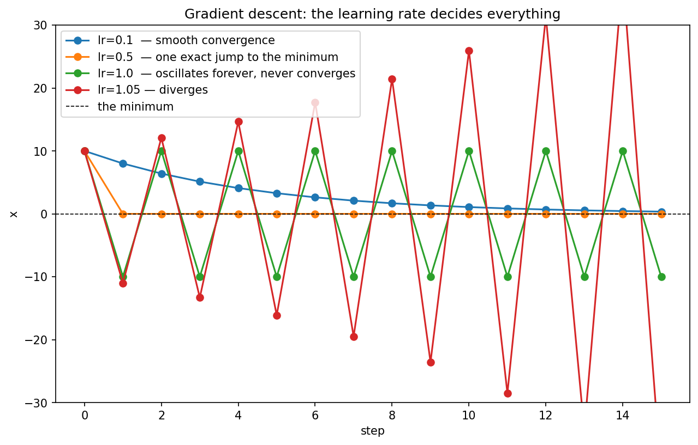
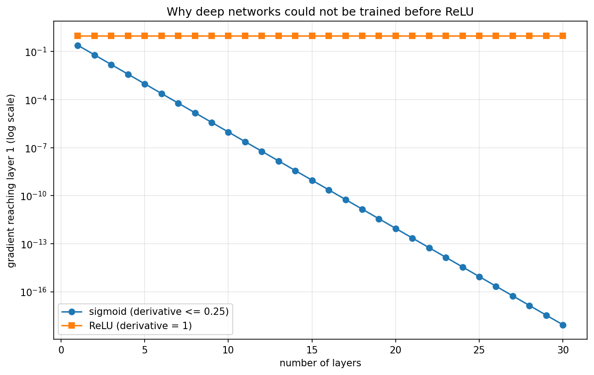
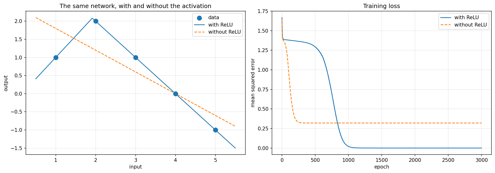

# Neural Networks from Scratch

Gradient descent, backpropagation, and a working neural network implemented in NumPy from the mathematics — no ML frameworks.

The point is not to reproduce what PyTorch does well. Each component was derived on paper first, implemented, and then **deliberately broken** to show what it is actually doing. The failure modes are the findings.

---

## Contents

| File | What it contains |
|---|---|
| `01_gradient_descent.py` | Gradient descent from scratch; the four distinct behaviours of the learning rate |
| `02_backpropagation.py` | The chain rule layer by layer, verified against hand-computed derivatives and against numerical gradients |
| `03_neural_network.py` | A two-neuron network that learns a non-linear function; the ReLU ablation; the dying-ReLU and zero-initialization failures |
| `experiments/` | Plots produced by the files above |

All randomness is seeded, so every number quoted below is reproducible.

---

## The learning rate decides everything



Minimizing `f(x) = x²` from `x = 10`. The update rule is one line:

```python
x = x - learning_rate * gradient(x)
```

Four learning rates, four qualitatively different outcomes:

| lr | behaviour | why |
|---|---|---|
| 0.1 | smooth convergence | each step improves on the last |
| **0.5** | **reaches the minimum in one step** | `x − 0.5·(2x) = 0` for any starting x |
| **1.0** | **oscillates between +10 and −10 forever** | the step lands exactly on the mirror image; the loss never changes |
| 1.05 | diverges | each bounce overshoots slightly further than the last |

Both middle rows were derived by hand before the code was written, then confirmed by running it.

**`lr = 0.5` is exact, not lucky.** For `f(x) = x²`, the step `x − 0.5·(2x) = 0` lands on the minimum from *any* starting point. This is the optimal step that second-order methods (Newton's method) attempt to compute in general.

**`lr = 1.0` is the knife edge** — neither converging nor diverging, but a permanent standoff at unchanging loss:

```
10 → −10 → 10 → −10 → ...
```

In real training this appears as a loss curve that flattens and stops improving, which is why learning-rate schedules decay the step size over time rather than holding it fixed.

---

## Backpropagation, verified two independent ways

A two-layer network, `x → w₁ → h → w₂ → prediction`, with `x=2, w₁=3, w₂=4, y=30`.

Derived by hand:

```
d(loss)/d(pred) = 2(24 − 30)      = −12
d(loss)/d(w₂)   = −12 · h         = −12 × 6 = −72
d(loss)/d(w₁)   = −12 · w₂ · x    = −12 × 4 × 2 = −96
```

Then checked a second way that does not use the derivation at all — nudging each weight by ±1e-5 and measuring the change in loss (gradient checking):

```
w₁:  backprop −96.0    numerical −96.0000000006
w₂:  backprop −72.0    numerical −71.9999999994
```

The two routes agree to nine decimal places. The first check asks whether the code matches the derivation; the second asks whether the derivation matches reality. A derivation error repeated in code would pass the first check and fail the second.

---

## Why deep networks were impractical before ReLU



The gradient reaching the first layer is the product of every layer's local derivative. Sigmoid's derivative is at most 0.25; ReLU's is 1.

```
20 layers of sigmoid:   0.25²⁰ ≈ 0.0000000000009
20 layers of ReLU:      1²⁰    = 1
```

The first layer of a 20-layer sigmoid network receives essentially no signal and never learns. On a log axis the sigmoid line falls as a straight diagonal — the signature of exponential decay — while ReLU stays flat at 1 regardless of depth.

This is the arithmetic behind one of the most consequential architectural changes in deep learning.

---

## The activation function is not decoration



Two neurons trained on data that rises to a peak and then falls — `[1, 2, 1, 0, −1]` — with and without the activation. Everything else identical: same data, same initialization, same 3000 epochs, same learning rate.

```
with ReLU:     final loss 0.00000     predictions [1.0, 2.0, 1.0, 0.0, −1.0]
without ReLU:  final loss 0.32000     the best possible straight line
```

Removing the activation collapses the network algebraically:

```
prediction = p(w₁x + b₁) + q(w₂x + b₂)
           = (p·w₁ + q·w₂)x + (p·b₁ + q·b₂)
```

Six parameters, one straight line. Depth buys nothing without a non-linearity.

### Where the bend comes from

ReLU switches at zero *of its own input*, `w·x + b`, so the bend sits at `x = −b/w`. The trained network placed neuron B's bend at

```
x = 1.939 / 1.012 ≈ 1.92
```

— between the first two data points — and the output layer weighted that neuron at `q = −2.16`. Below x ≈ 1.92 the neuron is asleep and the curve rises; above it, the neuron activates and its negative weight drags the output down harder than the other neuron pushes it up. The kink visible in the left panel is at exactly that computed position.

### What the loss curves show

The two curves in the right panel fail in completely different ways.

The **linear** model drops fast, flattens at 0.32 by roughly epoch 250, and stays there for 2,750 more epochs. That flatness is not slow learning — it is a structural ceiling. It has found the best straight line and no amount of further training can help.

The **ReLU** model sits on a plateau near 1.39 for roughly 600 epochs, then falls off a cliff around epoch 700 and reaches zero by epoch 1,100. During the plateau the network was slowly moving the bend into position; the loss barely moved because the bend was in the wrong place. Once it arrived near x ≈ 1.92 the target shape became representable and the loss collapsed.

**A run abandoned at epoch 500 would have looked hopeless while being one adjustment away from a perfect fit.**

---

## The dying ReLU, observed

The result above uses `seed=3`. With `seed=1` — identical in every other respect — the network fails, and the failure is instructive.

Neuron B's pre-activation is negative across the entire data range:

```
x=1: −0.530    x=2: −0.401    x=3: −0.273    x=4: −0.144    x=5: −0.015
```

Its bend sits at `x = 0.659 / 0.129 = 5.11`, just outside the data. So ReLU outputs zero for every input, its derivative is zero, and therefore the gradients for `w₂` and `b₂` are **exactly zero at every step**. The neuron never updates and cannot recover — the failure is self-locking.

The network collapses to a single linear unit:

```
prediction = p·w₁·x + p·b₁,     where p·w₁ = 1.423 × (−0.281) = −0.4
```

which matches the observed output `[1.6, 1.2, 0.8, 0.4, 0.0]` exactly — a straight line of slope −0.4.

Final loss 0.44, **worse than the linear model's 0.32**, because it is fitting a straight line with one neuron instead of two.

Same code, same data, same hyperparameters. Only the six random starting values differed.

---

## Why random initialization is required, not preferred

With every parameter set to zero, all activations are zero, so every gradient is a product containing a zero factor:

```
d(loss)/d(p) = d(loss)/d(pred) × a  = something × 0 = 0
d(loss)/d(a) = d(loss)/d(pred) × p  = something × 0 = 0
```

Nothing updates, so the parameters stay at zero forever:

```
parameters after 1000 epochs: [0. 0. 0. 0. 0. 0.]
```

The network is frozen at initialization and cannot leave it.

---

## Running

```bash
pip install -r requirements.txt
python 01_gradient_descent.py
python 02_backpropagation.py
python 03_neural_network.py
```

Each file writes its plots to `experiments/`.

---

## Approach

Every component was derived on paper before being written in code, and the hand-computed values are used as the test: if the implementation and the derivation disagree, one of them is wrong.

The mathematical background this rests on — linear algebra, calculus, probability, and statistics, worked through from first principles — is in a separate repository: [ml-research-foundations](https://github.com/VijayPratapS/ml-research-foundations).
